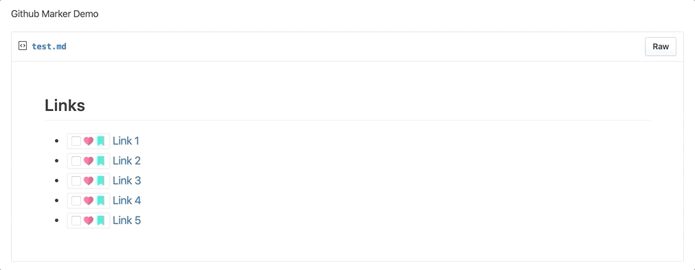

# Github Marker

## **A chrome extension marker for Github links**

## Features

- Mark link as Read/Unread
- Bookmark/Un-Bookmark link
- Mark link as Favorite/Un-Favorite

---

Note: Extension available only for **github** links

### Release Notes

#### v2
- New Icons
- Moved checkbox to icon
- Tracking icons form on & off states
- Refactored folder structure

### Credits

Icons (Bookmark Icon) made by <a href="https://www.flaticon.com/authors/kiranshastry" title="Kiranshastry">Kiranshastry</a> from <a href="https://www.flaticon.com/" title="Flaticon">www.flaticon.com</a>

Icons (Checkmark & Heart Icon) made by <a href="https://www.freepik.com" title="Freepik">Freepik</a> from <a href="https://www.flaticon.com/" title="Flaticon">www.flaticon.com</a>

